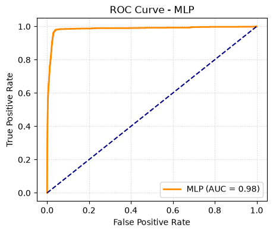
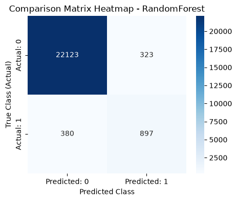
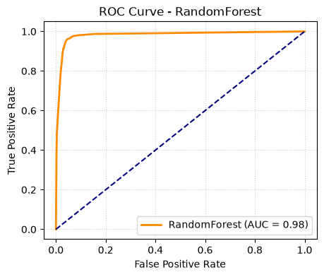
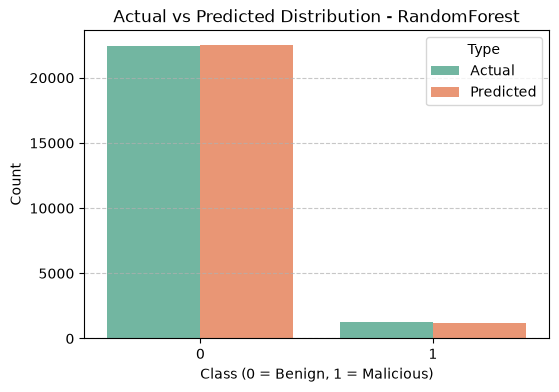
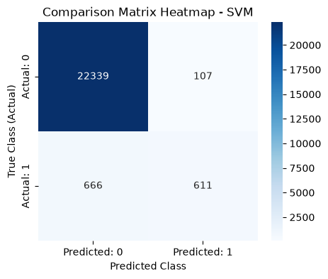
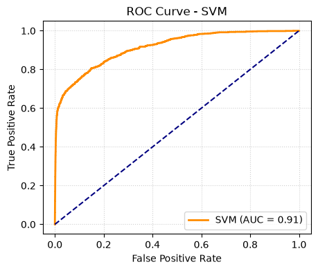
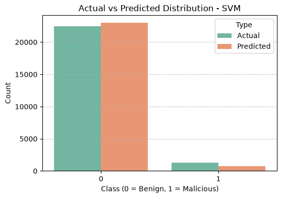
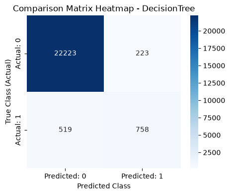
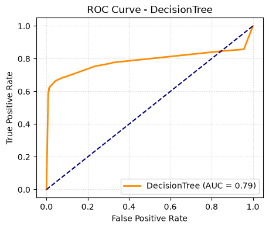

## 📷 Results

### 1. Multi-Layer Perceptron (MLP)

#### Confusion Matrix

#### ROC Curve

#### Actual vs Predicted Distribution

---

### 2. Random Forest

#### Confusion Matrix

#### ROC Curve

#### Actual vs Predicted Distribution

---

### 3. Support Vector Machine (SVM)

#### Confusion Matrix

#### ROC Curve

#### Actual vs Predicted Distribution

---

### 4. Decision Tree

#### Confusion Matrix

#### ROC Curve

#### Actual vs Predicted Distribution

